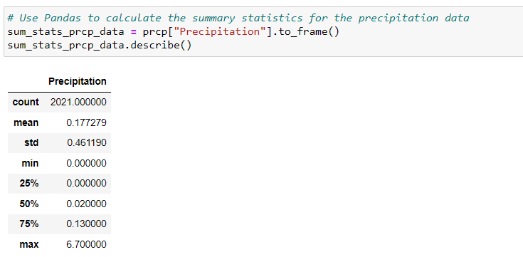

# Climate Analysis

* I decided to treat myself to a long holiday vacation in Honolulu, Hawaii. To help with my trip planning, I decided to do a climate analysis about the area. The following sections outline the steps that I needed to take to accomplish this task.

# Part 1: Analyze and Explore the Climate Data
* I used Python and SQLAlchemy to do a basic climate analysis and data exploration of your climate database. Specifically, I used SQLAlchemy ORM queries, Pandas, and Matplotlib.

# For Precipitation Analysis:
* I found the most recent date in the dataset.
* Using that date, I got the previous 12 months of precipitation data by querying the previous 12 months of data.
* I selected only the "date" and "prcp" values.
* I loaded the query results into a Pandas DataFrame. Explicitly set the column names.
* I sorted the DataFrame values by "date".
* I plotted the results by using the DataFrame plot method, as the following image shows in the climate starter ipynb 

* Used Pandas to print the summary statistics for the precipitation data.

# For station Analysis:
  I designed a query to calculate the total number of stations in the dataset.

  Designed a query to find the most-active stations (that is, the stations that have the most rows). 

To do so, I completed the following steps:

       Listed the stations and observation counts in descending order.

       Answered the following question: which station id had the greatest number of observations?

  Designed a query that calculates the lowest, highest, and average temperatures that filters on the most-active station id found in the previous query.

  Designed a query to get the previous 12 months of temperature observation (TOBS) data. 
  
  To do so, I completed the following steps:

       Filtered by the station that had the greatest number of observations.

       Queried the previous 12 months of TOBS data for that station.

       Plotted the results as a histogram with bins=12, as the following image shows in climate starter ipynb

  Closed my session.

  Part 2: Design Your Climate App

I designed a Flask API based on the queries that you just developed. To do so, use Flask to create your routes as follows:

1. /

Started at the homepage.

Listed all the available routes.

2. /api/v1.0/precipitation

Converted the query results from my precipitation analysis (i.e. retrieved only the last 12 months of data) to a dictionary using date as the key and prcp as the value.

Returned the JSON representation of my dictionary.

3. /api/v1.0/stations

Returned a JSON list of stations from the dataset.

4. /api/v1.0/tobs

Queried the dates and temperature observations of the most-active station for the previous year of data.

Returned a JSON list of temperature observations for the previous year.

5. /api/v1.0/<start> and /api/v1.0/<start>/<end>

Returned a JSON list of the minimum temperature, the average temperature, and the maximum temperature for a specified start or start-end range.

For a specified start, I calculated TMIN, TAVG, and TMAX for all the dates greater than or equal to the start date.

For a specified start date and end date, I calculated TMIN, TAVG, and TMAX for the dates from the start date to the end date, inclusive.

